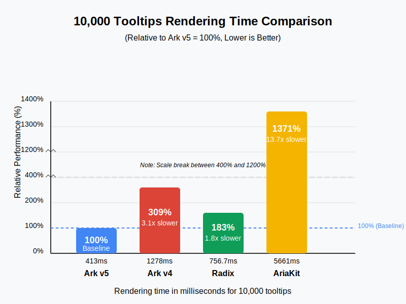

## [Unreleased]

## [5.9.2] - 2025-05-24

### Fixed

- **Collection**: Export `CollectionOptions`, `TreeCollectionOptions`, `GridCollectionOptions` types.

- **Carousel**

  - Fix issue where focusing on carousel region and navigating with keyboard doesn't work as expected
  - Fix issue when `allowMouseDrag` is set where carousel no longer snaps after mouse interaction

- **Combobox**: Fix issue where `onInputValueChange` doesn't get called when `autoFocus` is set to `true`

- **Slider**: Fix issue where slider could throw a error when rendered in an popover or dialog

- **Tour**: Fix issue where calling `api.start(<id>)` with a step id doesn't work as expected

## [5.9.1] - 2025-05-12

### Fixed

- **Combobox**: Fixed issue where `focusable` prop was not being applied to the trigger element.

- **Collection**: Fix issue where `getNextValue` and `getPreviousValue` doesn't work as expected when `groupBy` is used.

## [5.9.0] - 2025-05-05

### Added

- **Locale**: Added `useFilter` hook to filter data based on the current locale.
- **Format**: Added `FormatRelativeTime` component for formatting relative time.

## [5.8.0] - 2025-05-01

### Added

- **Date Picker**: Added support for `outsideDaySelectable` prop to allow selecting days outside the current month (on
  the same visible date range)

### Fixed

- **Collapsible**: Fixed issue in React.js <= v18.x where collapse animation might not work as expected

## [5.7.0] - 2025-04-25

### Added

- **[NEW] Listbox**: Introduced the `Listbox` component for selecting a single or multiple items from a list. See the
  [documentation](https://ark-ui.com/docs/components/listbox) for details.
- Improved support for grouping collection items. Check the `Listbox`, `Select` or `Combobox` documentation for more
  details.

### Changed

- Added `package.json` to `exports` for improved compatibility with tools like Vite.

## [5.6.0] - 2025-04-15

### Added

- **[NEW] AngleSlider**: Introduced the `AngleSlider` component for selecting an angle. See the
  [documentation](https://ark-ui.com/docs/components/angle-slider) for details.
- **[NEW] FloatingPanel**: Introduced the `FloatingPanel` component for creating floating windows. See the
  [documentation](https://ark-ui.com/docs/components/floating-panel) for details.
- **Toast**: Added toast queuing when the max limit is reached:
  - New toasts were queued instead of dropped
  - Queued toasts were shown when space became available
  - Queue cleared when all toasts were removed
- **Combobox**:
  - Fallbacked to the trigger element as the positioning anchor
  - Added `data-empty` attribute to indicate an empty listbox or content

## [5.5.0] - 2025-04-05

### Added

- **Presence**: Added support for skipping the initial animation when the component is mounted. This can be used in all
  disclosure components (e.g., `Dialog`, `DatePicker`, `Menu` etc).

### Fixed

- **Tabs**: Fixed issue where tabs indicator animation behaves inconsistently.

- **Date Picker**

  - Fixed issue where datepicker throws error when navigating month view.
  - Fixed issue where range selection doesn't reset correctly when clicking the same start date.

- **Disclosure Components**

  - Fixed issue where pointerdown outside doesn't work consistently on mobile devices.
  - Improved pointerdown outside click detection in shadow DOM environments.

## [5.4.0] - 2025-03-28

### Added

- **Slider**

  - Add support for `origin: end` to align the thumb to the end of the track.
  - Expose `thumbSize` as CSS variables in the root element. Can be useful for styling the slider.

- **Menu**

  - Added `onSelect` event to the `Menu.Item` component.

### Fixed

- Ensured each component's state machine starts before processing events.
- **HoverCard, ColorPicker**: Added missing `tabIndex` for better dialog support.
- **Menu**: Assigned unique IDs to menu items to improve accessibility and HTML validation.

## [5.3.1] - 2025-03-24

### Fixed

- Fixed an issue where a function was imported from a package that wasn't declared as a dependency.

## [5.3.0] - 2025-03-24

### Added

- **Collapsible**: Added an `Indicator` part to display whether the collapsible was open or closed.
- **ColorPicker**: Added support for formatting the `ValueText` component.

```tsx
<ColorPicker.ValueText format="hex" /> // #ff0000
```

### Fixed

- **Combobox**: Fixed an issue where `onOpenChange` was called with the same `open` value.
- **DownloadTrigger**: Added the missing `use client` directive.
- **Splitter**: Fixed an issue where `onResizeStart` and `onResizeEnd` callbacks weren't triggered during keyboard
  interactions.

## [5.2.0] - 2025-03-22

### Added

- **[NEW] DownloadTrigger**: Added Component for downloading a blob or file, whether retrieved synchronously or
  asynchronously.

```tsx
import { DownloadTrigger } from '@ark-ui/react/download-trigger'

export const DownloadImage = () => {
  async function fetchImage() {
    const response = await fetch('https://picsum.photos/200/300')
    return response.blob()
  }

  return (
    <DownloadTrigger data={fetchImage} fileName="avatar.jpeg" mimeType="image/jpeg">
      Download Image
    </DownloadTrigger>
  )
}
```

### Changed

- **NumberInput**: Set the default step to `0.01` when `formatOptions.style` was set to `percent`.
- **[Breaking] Splitter**: Redesigned splitter machine to support more use cases and improve DX. Check out the
  [Splitter](https://ark-ui.com/docs/components/splitter) documentation for more details.

### Fixed

- **Toast**: Fixed issue where setting `offsets` to `undefined` caused the machine to throw.
- **Select**: Fixed issue where select `valueAsString` lost reactivity.

## [5.1.0] - 2025-03-17

### Added

- Added support for a cleanup function in `ref`.

### Fixed

- **Field**: Exported the missing `useField` hook.
- **NumberInput**: `onValueChange` correctly received `valueAsNumber`.
- **Slider**: Thumbs initialized correctly when `min` was set to a non-zero value.

## [5.0.1] - 2025-03-11

### Fixed

- Effects now flush synchronously instead of using a microtask.
- **Checkbox**: `data-invalid` is no longer set when `invalid` is `false`.
- **Combobox**: Fixed unexpected cursor movement when editing input.
- **PinInput**: OTP SMS autofill now works as expected.
- **RatingGroup**: Fixed incorrect focus placement on the label.
- **TagsInput**: Improved caret detection to prevent unintended tag removal.
- **Timer**
  - Fixed slowdown when switching tabs/windows.
  - Changed default `interval` from `250` to `1000`.

## [5.0.0] - 2025-03-06

Ark UI just got a major performance boost! 🚀

### What’s new in v5?

- **Blazing-fast performance** – Every component runs smoother and renders faster.
- **Smaller bundle size** – Leaner components and adapters for a more efficient build.

We made this happen by using React’s native reactive primitives instead of external stores.

In our stress tests with **10,000 components**, Ark v5 delivered **1.5x–4x** better performance across the board.



### A quick note on tests

Most component updates are non-breaking, but due to this change, some tests may need adjustments. For example:

```jsx
// Before
it('should open by default', () => {
  render(<ComponentUnderTest defaultOpen />)
  expect(screen.getByRole('dialog')).toBeInTheDocument()
})

// After
it('should open by default', async () => {
  render(<ComponentUnderTest defaultOpen />)
  expect(await screen.findByRole('dialog')).toBeInTheDocument()
})
```

#### Added

- **Carousel**: ⚠️ Breaking change: Added required prop `slideCount` to `Carousel.Root` component.
- **Clipboard**: Added `onValueChange` and `defaultValue` props.
- **ColorPicker**: Added `defaultFormat` prop.
- **Combobox**: Added `defaultHighlightedValue` and `defaultInputValue` props.
- **DatePicker**: Added `defaultFocusedValue` prop, `getViewProps`, and `visibleRangeText`.
- **HoverCard**: Expanded interaction handlers.
- **Menu**: Added `defaultHighlightedValue` prop.
- **Pagination**: Added `defaultPageSize` prop.
- **PinInput**: Added `count` prop for better SSR aria-label.
- **Progress**: Added `locale` and `formatOptions` props.
- **QrCode**: Added `pixelSize` prop.
- **Select**: Added `defaultHighlightedValue` prop.
- **TagsInput**: Added `defaultInputValue` prop.
- **Toggle**: Reintroduced toggle machine.

#### Fixed

- **Accordion**: Fixed issue in Safari where clicking triggers didn't show content.
- **Avatar**: Fixed `api.setSrc` not working.
- **Carousel**: Fixed pagination sync and initial page issues.
- **File Upload**: Fixed drag-and-drop when `directory: true`.
- **Menu**: Fixed context menu positioning not updating on right-click.
- **Number Input**: Fixed `value` prop not being consumed.
- **Pin Input**: Fixed focus warnings and editing issues.
- **Progress**: Allowed more precise (decimal) values.
- **Radio Group, Switch**: Improved focus behavior in Safari.
- **Select**: Fixed regression where `multiple: true` didn't work.
- **Steps**: Ensured ARIA attributes use valid values and wrapped `<li>` elements correctly within `<ul>` or `<ol>`.
- **Textarea**: Fixed `ResizeObserver` warning.
- **Timer**: Fixed stopping issue when switching tabs; resolved issue where `action` prop was passed to `ActionTrigger`.
- **Toast**: Fixed keyboard navigation skipping close button.
- **Toggle Group**: Fixed `data-focus` not being removed on blur.
